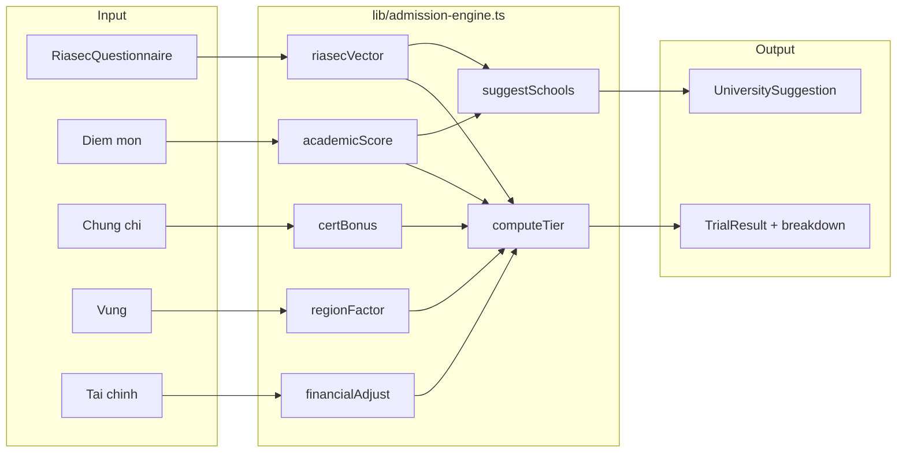

## Xây dựng lại tính tỉ lệ đỗ

### Tính cách

- Xây dựng theo hướng RIASEC chuẩn hóa thành vector

- 6 - 10 câu hỏi: Đánh giá theo mức độ từ 1 đến 5

### Năng lực

- Các môn: Toán Văn và 2 môn tự chọn

- Chứng chỉ:
    - IELTS: 
    - SAT
    - HSG Tỉnh
    - HSG QG
    - Khoa học kỉ thuật

- Khu vực địa lý

- Tình hình tài chính

## Kế hoạch làm

### Hiện trạng

| Thành phần | File | Ghi chú |
| --- | --- | --- |
| Thuật toán demo | `lib/zpath-calc.ts` | Trung bình 4 môn + IELTS + giải văn hóa → `tier` |
| Form thử | `components/zpath/TrialForm.tsx` | SBTI, Toán/Văn/2 môn, IELTS, giải VH, vùng |
| Tính cách | `components/zpath/SbtiPicker.tsx` | 4 câu → SBTI — **sẽ bỏ** |
| Career match (riêng) | `lib/matching-engine.ts` | Dashboard/chat — không trong scope tỉ lệ đỗ |
| Ghi chú kỹ thuật | `NOTES.md` | Bug personality ASCII vs Unicode trên engine cũ |

### Mục tiêu

1. **Tính cách**: Khảo sát RIASEC (6–10 câu, thang 1–5) → vector 6 chiều chuẩn hóa `[0,1]`.
2. **Năng lực**: Giữ Toán, Văn, 2 môn tự chọn; bổ sung SAT, HSG Tỉnh/QG, HSG KHKT; giữ IELTS; thêm **tình hình tài chính**.
3. **Kết quả**: `tier` (LOW/MID/HIGH) + **breakdown** điểm từng nhóm + **danh sách trường gợi ý** (heuristic đơn giản, chưa so điểm chuẩn chi tiết từng ngành).
4. **Giai đoạn sau** (không làm ngay): benchmark `admissionScore` từ `data/universities.ts` theo nguyện vọng cụ thể.

### Giai đoạn 1 — Nền tảng types & hằng số (~4h)

- Mở rộng `types/zpath.ts`: `RiasecDimension`, `RiasecAnswers`, `RiasecVector`; bỏ `sbti` khỏi `TrialFormData`; thêm `riasecAnswers`, `sat`, `hsgProvince`, `hsgNational`, `stemAward`, `financialLevel`; mở rộng `TrialResult` với `breakdown`, `suggestedUniversities[]`.
- Tạo `lib/riasec.ts`: 6–8 câu hỏi map → R/I/A/S/E/C, `buildRiasecVector(answers)`.
- Tạo `lib/admission-weights.ts`: bảng hệ số IELTS/SAT/HSG, `regionFactor`, `financialLevel` (config tách khỏi logic).

### Giai đoạn 2 — UI form (~6h)

- Tạo `components/zpath/RiasecQuestionnaire.tsx`: Likert 1–5, progress, validate đủ câu.
- Sửa `components/zpath/TrialForm.tsx`: thay `SbtiPicker` → `RiasecQuestionnaire`; section chứng chỉ (SAT, HSG tỉnh/QG, KHKT); select tài chính.
- Sửa `ResultPanel` trong `TrialForm.tsx`: hiển thị breakdown + 3–5 trường gợi ý.
- Deprecate/xóa dùng `SbtiPicker.tsx` trên trial flow (giữ file tạm nếu profile còn dùng — xem GĐ4).

### Giai đoạn 3 — Thuật toán (~8h)

- Tạo `lib/admission-engine.ts`: `computeAdmissionResult(data: TrialFormData): TrialResult`.
  - **Academic** (0–1): trọng số Toán cao hơn Văn; 2 môn tự chọn theo tên môn (map nhẹ, vd. Lý/Hóa → STEM).
  - **Cert bonus**: cộng dồn có trần; thay logic cũ trong `lib/zpath-calc.ts`.
  - **Region**: hệ số nhóm vùng (Hà Nội/HCM/…/Khác) — placeholder, TODO data thật.
  - **Financial**: điều chỉnh ngưỡng tier hoặc message (gợi ý trường học phí thấp hơn).
  - **RIASEC**: dùng cho `suggestSchools` (cosine/Jaccard với tag RIASEC trong `lib/university-tags.ts` mới).
  - `suggestSchools`: lọc ~5 trường từ `data/universities.ts` theo điểm tổng hợp + tag RIASEC — **không** so `admissionScore2025` chi tiết.
- `lib/zpath-calc.ts`: re-export hoặc delegate sang `admission-engine` để không gãy import.

### Giai đoạn 4 — Đồng bộ Profile (~5h)

- `types/profile.ts`, `app/profile/page.tsx`, `lib/profile-db.ts`: đổi `sbti` → `riasecVector` hoặc `riasecAnswers`; thêm field chứng chỉ/tài chính.
- Migration Supabase (`supabase/migrations/*_profile_riasec.sql`): cột `riasec_json`, `sat`, `hsg_*`, `financial_level`.
- Chạy `npx supabase db diff` sau khi apply local.

### Giai đoạn 5 — Kiểm thử & dọn dẹp (~3h)

- Unit test `lib/__tests__/admission-engine.test.ts`: vector RIASEC, tier ngưỡng, gợi ý trường không rỗng.
- Cập nhật copy demo trong `ResultPanel` (bỏ “thuật toán demo” nếu đã có breakdown).
- Cập nhật `NOTES.md` pipeline v2.

### Danh sách file

| Hành động | File |
| --- | --- |
| Sửa | `types/zpath.ts`, `lib/zpath-calc.ts`, `components/zpath/TrialForm.tsx`, `types/profile.ts`, `app/profile/page.tsx`, `lib/profile-db.ts` |
| Tạo mới | `lib/riasec.ts`, `lib/admission-weights.ts`, `lib/admission-engine.ts`, `lib/university-tags.ts`, `components/zpath/RiasecQuestionnaire.tsx`, `lib/__tests__/admission-engine.test.ts`, `supabase/migrations/*_profile_riasec.sql` |
| Deprecated | `components/zpath/SbtiPicker.tsx` (sau GĐ4) |
| Không đụng | `lib/matching-engine.ts` |

### Timeline

| GĐ | Nội dung | Ước lượng |
| --- | --- | --- |
| 1 | Types + RIASEC + weights | 4h |
| 2 | UI TrialForm + ResultPanel | 6h |
| 3 | admission-engine + gợi ý trường | 8h |
| 4 | Profile + Supabase migration | 5h |
| 5 | Tests + docs | 3h |
| **Tổng** | | **~26h** (~3–4 ngày) |

Buffer +10% cho UX/validate edge case: **~28–29h**.

### Rủi ro & ghi chú

- **Dữ liệu vùng/chuẩn**: GĐ1 dùng hệ số config; tích hợp RAG `app/lib/admissions-rag.ts` là phase riêng.
- **Hai model profile**: `lib/types.ts` (Discover cũ) vs `types/profile.ts` — chỉ đồng bộ nhánh Trial/Profile ZPATH.
- **SBTI**: User chọn thay hoàn toàn; migration profile cần default vector rỗng cho user cũ.

## Doing

### Trắc nghiệm tính cách RIASEC

